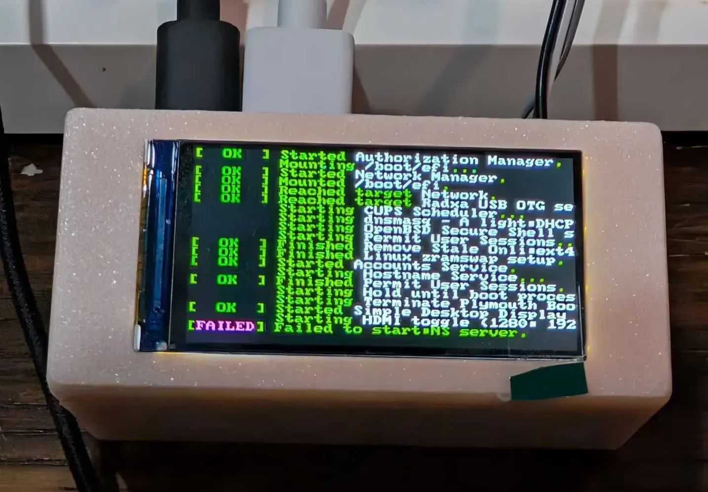

# u-boot-aw2501

## Project hardware

ZeroPC hardware using the Radxa Cubie A7z (Allwinner A733).

[Hardware project and image source](https://oshwhub.com/jasonyang17/zero-screen)

## Build

1. `git clone --recurse-submodules https://github.com/radxa-pkg/u-boot-aw2501.git`
2. Open in [`devcontainer`](https://code.visualstudio.com/docs/devcontainers/containers)
3. `make deb`
# ZeroA733-Uboot
# ZeroA733-Uboot
